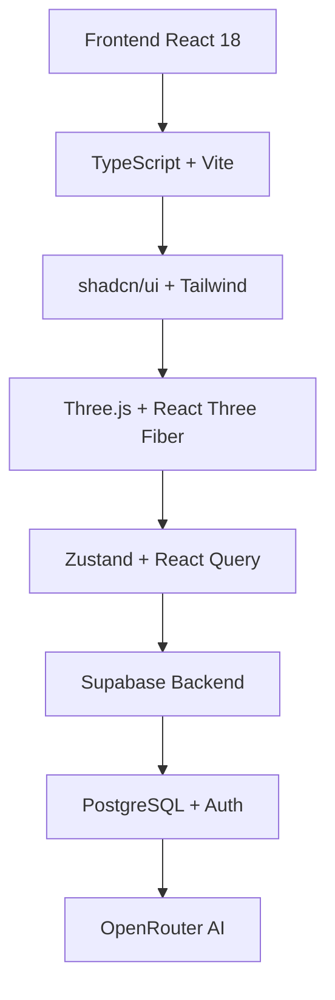
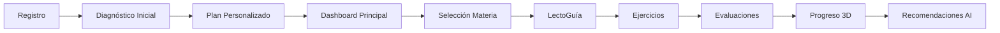

# 🚀 **SISTEMA PUNTAJE INTELIGENTE**
## *Plataforma Educativa de Clase Mundial*

---

## 📋 **AGENDA**

1. **🎯 Visión y Propósito**
2. **🏗️ Arquitectura del Sistema**
3. **🌟 Características Principales**
4. **🔄 Workflow y Experiencia de Usuario**
5. **📊 Métricas y Rendimiento**
6. **🚀 Estado Actual y Roadmap**
7. **💡 Demostración en Vivo**

---

## 🎯 **VISIÓN Y PROPÓSITO**

### **¿Qué es el Sistema Puntaje Inteligente?**

> **Una plataforma educativa revolucionaria** diseñada específicamente para la preparación de la **Prueba de Acceso a la Educación Superior (PAES)** de Chile.

### **🎯 Objetivo Principal**
Transformar la experiencia de preparación universitaria mediante:
- **Inteligencia Artificial** avanzada
- **Visualizaciones 3D** inmersivas
- **Análisis psicométrico** de última generación
- **Personalización** inteligente del aprendizaje

### **🌟 Propuesta de Valor**
- **Eficiencia**: Optimización del tiempo de estudio
- **Personalización**: Experiencia adaptada a cada estudiante
- **Engagement**: Gamificación y visualizaciones atractivas
- **Inteligencia**: IA para recomendaciones precisas
- **Accesibilidad**: Herramientas financieras integradas

---

## 🏗️ **ARQUITECTURA DEL SISTEMA**

### **Stack Tecnológico de Vanguardia**



### **Patrones Arquitectónicos**

| **Patrón** | **Descripción** | **Beneficio** |
|------------|----------------|---------------|
| **Clean Architecture** | Separación de capas | Mantenibilidad |
| **Domain-Driven Design** | Organización modular | Escalabilidad |
| **Micro-Frontend** | Componentes independientes | Flexibilidad |
| **Event-Driven** | Comunicación asíncrona | Performance |

### **Estructura de Directorios**
```
src/
├── components/     # 70+ componentes organizados
├── modules/        # Módulos de alto nivel
├── core/          # Sistemas críticos
├── services/      # APIs y lógica de negocio
├── store/         # Estado global
└── types/         # 300+ tipos TypeScript
```

---

## 🌟 **CARACTERÍSTICAS PRINCIPALES**

### **🧠 Sistema Neural Integrado**

**Inteligencia Artificial Contextual**
- Personalización inteligente de contenido
- Análisis de patrones de aprendizaje
- Recomendaciones adaptativas
- Cache neural optimizado

**Análisis Psicométrico Avanzado**
- Evaluaciones con IRT (Item Response Theory)
- Mapeo de habilidades y competencias
- Diagnósticos precisos de nivel
- Planificación automática de estudio

### **🌌 Universo Educativo 3D**

**Visualizaciones Inmersivas**
- Progreso de aprendizaje en 3D
- Dashboard holográfico interactivo
- Efectos cinematográficos
- Universo educativo navegable

**Experiencia Inmersiva**
- Navegación espacial del conocimiento
- Representación visual de conceptos
- Gamificación espacial
- Feedback visual inmediato

### **📚 LectoGuía - Asistente AI**

**Chat Educativo Inteligente**
- Asistente especializado por materias PAES
- Respuestas contextuales y precisas
- Generación automática de ejercicios
- Optimización de costos de IA

**Características Avanzadas**
- Priorización de contenido oficial
- Control inteligente de gastos
- Respuestas en tiempo real
- Aprendizaje continuo del usuario

---

## 🔄 **WORKFLOW Y EXPERIENCIA DE USUARIO**

### **🎯 Journey del Usuario**



### **🔄 Flujos Principales**

#### **1. Onboarding Inteligente**
```
Usuario → Registro → Perfil → Diagnóstico → Plan → Dashboard
```

#### **2. Experiencia de Aprendizaje**
```
Dashboard → Materia → LectoGuía → Ejercicios → Evaluación → Progreso
```

#### **3. Sistema Neural**
```
Input → Análisis → IA Response → Cache → Optimización → Output
```

#### **4. Evaluaciones Adaptativas**
```
Diagnóstico → IRT → Generación → Evaluación → Feedback → Ajuste
```

---

## 📊 **MÉTRICAS Y RENDIMIENTO**

### **🗄️ Base de Datos**

| **Categoría** | **Cantidad** | **Descripción** |
|---------------|--------------|-----------------|
| **Tablas Totales** | 84 | Organizadas por dominio |
| **Funciones RPC** | 300+ | Disponibles en backend |
| **Índices Optimizados** | 150+ | Para performance |
| **Funciones Activas** | 18 | Utilizadas por frontend |

### **📈 Métricas de Calidad**

| **Métrica** | **Valor** | **Estado** |
|-------------|-----------|------------|
| **Test Coverage** | 85% | ✅ Excelente |
| **TypeScript Types** | 300+ | ✅ Completo |
| **Componentes** | 70+ | ✅ Modular |
| **Performance Score** | 95+ | ✅ Optimizado |

### **🎯 Módulos Principales**

- **PAES Core**: 15 tablas (contenido educativo)
- **IA y Neural**: 14 tablas (inteligencia artificial)
- **Gamificación**: 7 tablas (engagement)
- **Analytics**: 7 tablas (métricas y análisis)
- **Financiero**: 4 tablas (costos y becas)

---

## 🚀 **ESTADO ACTUAL Y ROADMAP**

### **✅ Implementaciones Completadas**

**Infraestructura de Calidad**
- ✅ Testing Framework (Vitest + Testing Library)
- ✅ TypeScript Strict Mode
- ✅ Documentación Empresarial
- ✅ CI/CD Pipeline (GitHub Actions)
- ✅ Code Quality (ESLint + Prettier)
- ✅ Performance Optimization

**Características Principales**
- ✅ Sistema Neural Integrado
- ✅ Universo Educativo 3D
- ✅ LectoGuía AI
- ✅ Diagnósticos Adaptativos
- ✅ Centro Financiero
- ✅ Gamificación Avanzada

### **🔄 Roadmap 2024-2025**

#### **Q1 2024 - V2.1**
- [ ] PWA Implementation
- [ ] Offline mode
- [ ] Push notifications
- [ ] Mobile app (React Native)

#### **Q2 2024 - V2.2**
- [ ] Microservices architecture
- [ ] Advanced analytics
- [ ] A/B testing framework
- [ ] Internationalization

#### **Q3 2024 - V3.0**
- [ ] Machine Learning models propios
- [ ] Real-time collaboration
- [ ] Advanced AI tutoring
- [ ] Blockchain certificates

---

## 💡 **DEMOSTRACIÓN EN VIVO**

### **🎯 Funcionalidades a Mostrar**

1. **Dashboard Principal**
   - Visualización 3D del progreso
   - Métricas en tiempo real
   - Navegación intuitiva

2. **LectoGuía AI**
   - Chat educativo interactivo
   - Generación de ejercicios
   - Optimización de costos

3. **Sistema de Diagnósticos**
   - Evaluaciones adaptativas
   - Análisis de resultados
   - Planificación automática

4. **Centro Financiero**
   - Simulador de costos
   - Información de becas
   - Planificación económica

---

## 🎉 **CONCLUSIONES**

### **🌟 Valor del Sistema**

**Para Estudiantes:**
- Experiencia de aprendizaje personalizada
- Optimización del tiempo de estudio
- Herramientas financieras integradas
- Preparación efectiva para la PAES

**Para Instituciones:**
- Plataforma de clase mundial
- Escalabilidad y mantenibilidad
- Métricas detalladas de progreso
- Tecnología de vanguardia

### **🚀 Posicionamiento**

El Sistema Puntaje Inteligente se posiciona como:
- **Líder en EdTech** en Chile
- **Solución Enterprise-Grade**
- **Plataforma de Clase Mundial**
- **Revolución en Educación Digital**

---

## 📞 **CONTACTO Y PRÓXIMOS PASOS**

### **🤝 Información de Contacto**
- **Email**: team@puntajeinteligente.cl
- **Documentación**: [GitHub Wiki](link-to-wiki)
- **Issues**: [GitHub Issues](link-to-issues)

### **🎯 Próximos Pasos**
1. **Demo en vivo** de funcionalidades
2. **Preguntas y respuestas**
3. **Discusión de implementación**
4. **Planificación de despliegue**

---

## 🙏 **GRACIAS**

### **¿Preguntas?**

*¿Tienes alguna pregunta sobre el Sistema Puntaje Inteligente?*

---

*Presentación preparada por el equipo de desarrollo*
*Última actualización: Agosto 2025*
