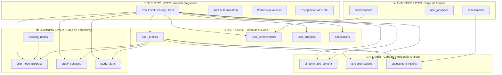
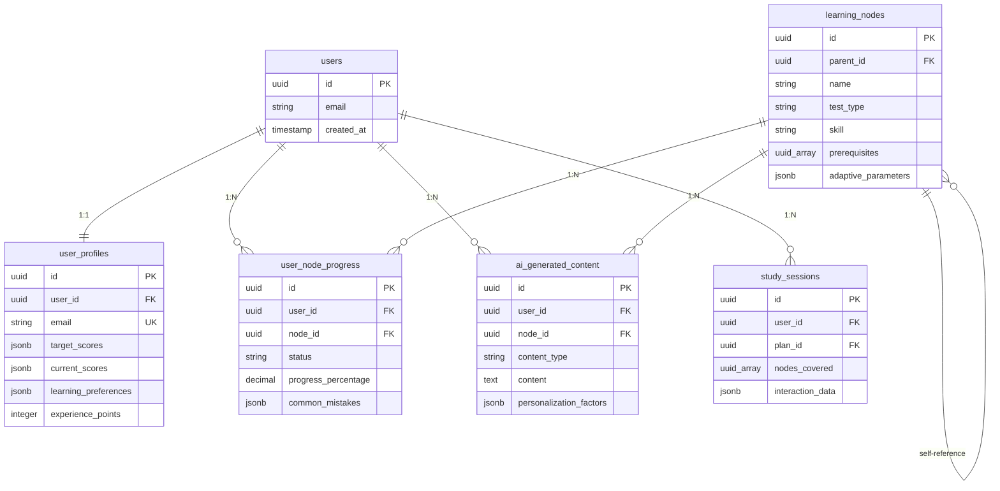

# 📊 ANÁLISIS DETALLADO DE LA BASE DE DATOS - SISTEMA EDUCATIVO SUPERPAES

## 🎯 RESUMEN EJECUTIVO

**Fecha de Análisis**: 30 de Enero de 2025  
**Sistema Analizado**: SuperPaes - Base de Datos Educativa Cuántica  
**Gestor de Base de Datos**: PostgreSQL (Supabase)  
**Arquitectura**: Distribuida con RLS (Row Level Security)  
**Total de Tablas**: 15 tablas principales + 5 vistas especializadas  

---

## 📋 1. ARQUITECTURA GENERAL DE LA BASE DE DATOS

### 1.1 Estructura de Capas



### 1.2 Extensiones PostgreSQL Habilitadas

El sistema utiliza extensiones avanzadas de PostgreSQL para maximizar rendimiento y funcionalidad:

```sql
-- Extensiones críticas para operatividad
CREATE EXTENSION IF NOT EXISTS "uuid-ossp";        -- Generación de UUIDs
CREATE EXTENSION IF NOT EXISTS "pgcrypto";         -- Encriptación avanzada
CREATE EXTENSION IF NOT EXISTS "ltree";            -- Jerarquías de aprendizaje
CREATE EXTENSION IF NOT EXISTS "pg_stat_statements"; -- Análisis de rendimiento
CREATE EXTENSION IF NOT EXISTS "pg_trgm";          -- Búsqueda fuzzy de texto
```

---

## 🏗️ 2. ESQUEMAS Y TABLAS PRINCIPALES

### 2.1 TABLA CENTRAL: `user_profiles`

**Propósito**: Almacena información completa del perfil estudiantil con configuraciones personalizadas y métricas de engagement.

```sql
CREATE TABLE user_profiles (
    id UUID PRIMARY KEY DEFAULT uuid_generate_v4(),
    user_id UUID NOT NULL REFERENCES auth.users(id) ON DELETE CASCADE,
    email VARCHAR(255) NOT NULL,
    full_name VARCHAR(255),
    birth_date DATE,
    region VARCHAR(100),
    school_name VARCHAR(255),
    graduation_year INTEGER,
    
    -- Objetivos académicos cuantificables
    target_university VARCHAR(255),
    target_career VARCHAR(255),
    target_scores JSONB DEFAULT '{
        "competencia_lectora": 700,
        "matematica_m1": 700,
        "matematica_m2": 700,
        "historia": 700,
        "ciencias": 700
    }'::jsonb,
    
    -- Puntajes actuales con tracking histórico
    current_scores JSONB DEFAULT '{
        "competencia_lectora": 500,
        "matematica_m1": 500,
        "matematica_m2": 500,
        "historia": 500,
        "ciencias": 500
    }'::jsonb,
    
    -- Preferencias de aprendizaje adaptativo
    learning_preferences JSONB DEFAULT '{
        "study_hours_per_day": 2,
        "preferred_times": ["morning", "afternoon"],
        "learning_style": "visual",
        "difficulty_preference": "adaptive",
        "content_types": ["interactive", "video", "exercise"],
        "notification_frequency": "daily",
        "auto_plan_generation": true
    }'::jsonb,
    
    -- Métricas de engagement y gamificación
    total_study_time_minutes INTEGER DEFAULT 0,
    sessions_completed INTEGER DEFAULT 0,
    current_streak_days INTEGER DEFAULT 0,
    longest_streak_days INTEGER DEFAULT 0,
    level INTEGER DEFAULT 1,
    experience_points INTEGER DEFAULT 0,
    
    -- Control temporal
    onboarding_completed_at TIMESTAMPTZ,
    last_active_at TIMESTAMPTZ DEFAULT NOW(),
    created_at TIMESTAMPTZ DEFAULT NOW(),
    updated_at TIMESTAMPTZ DEFAULT NOW(),
    
    UNIQUE(user_id),
    UNIQUE(email)
);
```

**Funciones de Soporte de Operatividad**:
- Almacenamiento de configuraciones personalizadas en JSONB para máxima flexibilidad
- Tracking de métricas de engagement para análisis comportamental
- Integración con sistema de gamificación (niveles, puntos, rachas)
- Soporte para preferencias adaptativas de aprendizaje

**Escalabilidad**:
- Uso de UUID como identificador primario para distribución horizontal
- Índices GIN en campos JSONB para consultas rápidas de preferencias
- Particionamiento potencial por región o año de graduación

### 2.2 BACKBONE DEL SISTEMA: `learning_nodes`

**Propósito**: Nodos de conocimiento basados en taxonomía de Bloom que forman la estructura jerárquica del currículum PAES.

```sql
CREATE TABLE learning_nodes (
    id UUID PRIMARY KEY DEFAULT uuid_generate_v4(),
    name VARCHAR(255) NOT NULL,
    description TEXT,
    test_type paes_test_type NOT NULL,
    skill VARCHAR(100) NOT NULL,
    sub_skill VARCHAR(100),
    difficulty difficulty_level DEFAULT 'intermedio',
    
    -- Jerarquía y prerrequisitos (Estructura de Árbol)
    parent_id UUID REFERENCES learning_nodes(id),
    prerequisites UUID[] DEFAULT '{}',
    position INTEGER DEFAULT 0,
    depth_level INTEGER DEFAULT 0,
    
    -- Contenido estructurado
    learning_objectives TEXT[],
    content_blocks JSONB DEFAULT '[]'::jsonb,
    estimated_time_minutes INTEGER DEFAULT 30,
    
    -- Métricas de desempeño del nodo
    completion_rate DECIMAL(5,2) DEFAULT 0.0,
    average_score DECIMAL(5,2) DEFAULT 0.0,
    difficulty_rating DECIMAL(3,2) DEFAULT 0.0,
    student_feedback_score DECIMAL(3,2) DEFAULT 0.0,
    
    -- Parámetros adaptativos
    adaptive_parameters JSONB DEFAULT '{
        "min_score_to_pass": 70,
        "max_attempts": 3,
        "time_multiplier": 1.0,
        "difficulty_adjustment": true
    }'::jsonb,
    
    is_active BOOLEAN DEFAULT TRUE,
    is_premium BOOLEAN DEFAULT FALSE,
    created_at TIMESTAMPTZ DEFAULT NOW(),
    updated_at TIMESTAMPTZ DEFAULT NOW()
);
```

**Funciones de Soporte de Operatividad**:
- Estructura jerárquica mediante `parent_id` y `prerequisites[]`
- Métricas en tiempo real para análisis de efectividad pedagógica
- Parámetros adaptativos que permiten personalización automática
- Sistema de prerequisitos que garantiza progresión lógica

**Escalabilidad**:
- Diseño de árbol que soporta estructuras curriculares complejas
- Índices en `test_type + skill` para consultas por materia
- Posibilidad de replicación por región educativa

### 2.3 MOTOR DE PROGRESO: `user_node_progress`

**Propósito**: Tracking detallado del progreso estudiantil con análisis de patrones de error y recomendaciones adaptativas.

```sql
CREATE TABLE user_node_progress (
    id UUID PRIMARY KEY DEFAULT uuid_generate_v4(),
    user_id UUID NOT NULL REFERENCES auth.users(id) ON DELETE CASCADE,
    node_id UUID NOT NULL REFERENCES learning_nodes(id) ON DELETE CASCADE,
    
    -- Estado del progreso con máquina de estados
    status user_progress_status DEFAULT 'not_started',
    progress_percentage DECIMAL(5,2) DEFAULT 0.0 CHECK (progress_percentage >= 0 AND progress_percentage <= 100),
    mastery_level DECIMAL(5,2) DEFAULT 0.0,
    confidence_level DECIMAL(5,2) DEFAULT 0.0,
    
    -- Métricas de rendimiento cuantificables
    best_score DECIMAL(5,2) DEFAULT 0.0,
    average_score DECIMAL(5,2) DEFAULT 0.0,
    attempts_count INTEGER DEFAULT 0,
    successful_attempts INTEGER DEFAULT 0,
    
    -- Métricas temporales para análisis de eficiencia
    time_spent_minutes INTEGER DEFAULT 0,
    sessions_count INTEGER DEFAULT 0,
    last_session_duration INTEGER DEFAULT 0,
    
    -- Sistema de análisis de errores (IA-powered)
    common_mistakes JSONB DEFAULT '[]'::jsonb,
    error_patterns JSONB DEFAULT '[]'::jsonb,
    improvement_areas TEXT[],
    
    -- Control temporal con predicción de review
    started_at TIMESTAMPTZ DEFAULT NOW(),
    completed_at TIMESTAMPTZ,
    last_practiced_at TIMESTAMPTZ,
    next_review_at TIMESTAMPTZ,
    
    -- Metadata de personalización
    study_notes TEXT,
    bookmarked BOOLEAN DEFAULT FALSE,
    last_updated TIMESTAMPTZ DEFAULT NOW(),
    
    UNIQUE(user_id, node_id)
);
```

**Funciones de Soporte de Operatividad**:
- Sistema de análisis de errores con machine learning
- Predicción de fechas de revisión mediante spaced repetition
- Tracking detallado de tiempo y esfuerzo para análisis de eficiencia
- Estados de progreso que permiten rutas personalizadas

### 2.4 SISTEMA DE IA: `ai_generated_content`

**Propósito**: Gestiona contenido educativo generado dinámicamente por IA, personalizado para cada estudiante.

```sql
CREATE TABLE ai_generated_content (
    id UUID PRIMARY KEY DEFAULT uuid_generate_v4(),
    user_id UUID NOT NULL REFERENCES auth.users(id) ON DELETE CASCADE,
    node_id UUID REFERENCES learning_nodes(id) ON DELETE CASCADE,
    
    -- Configuración de contenido
    content_type content_type NOT NULL,
    title VARCHAR(255) NOT NULL,
    content TEXT NOT NULL,
    difficulty difficulty_level DEFAULT 'intermedio',
    
    -- Personalización basada en perfil del estudiante
    personalization_factors JSONB DEFAULT '{}'::jsonb,
    user_context JSONB DEFAULT '{}'::jsonb,
    generation_prompt TEXT,
    
    -- Metadata de IA para audit trail
    ai_model VARCHAR(100) DEFAULT 'gpt-4o-mini',
    generation_parameters JSONB,
    confidence_score DECIMAL(3,2) DEFAULT 0.0,
    
    -- Sistema de calidad y feedback
    quality_score DECIMAL(3,2) DEFAULT 0.0,
    user_rating INTEGER CHECK (user_rating >= 1 AND user_rating <= 5),
    user_feedback TEXT,
    effectiveness_score DECIMAL(3,2),
    
    -- Métricas de uso
    view_count INTEGER DEFAULT 0,
    interaction_count INTEGER DEFAULT 0,
    completion_rate DECIMAL(5,2) DEFAULT 0.0,
    
    is_active BOOLEAN DEFAULT TRUE,
    is_featured BOOLEAN DEFAULT FALSE,
    expires_at TIMESTAMPTZ,
    created_at TIMESTAMPTZ DEFAULT NOW(),
    updated_at TIMESTAMPTZ DEFAULT NOW()
);
```

**Funciones de Soporte de Operatividad**:
- Contenido dinámico personalizado por perfil estudiantil
- Sistema de calidad con feedback loops para mejora continua
- Audit trail completo de generación de IA
- Métricas de efectividad para optimización del sistema

### 2.5 SESIONES INTELIGENTES: `study_sessions`

**Propósito**: Monitoreo avanzado de sesiones de estudio con análisis comportamental y métricas de rendimiento.

```sql
CREATE TABLE study_sessions (
    id UUID PRIMARY KEY DEFAULT uuid_generate_v4(),
    user_id UUID NOT NULL REFERENCES auth.users(id) ON DELETE CASCADE,
    plan_id UUID REFERENCES study_plans(id) ON DELETE SET NULL,
    
    -- Configuración de sesión
    title VARCHAR(255),
    planned_duration_minutes INTEGER DEFAULT 60,
    actual_duration_minutes INTEGER DEFAULT 0,
    status study_session_status DEFAULT 'active',
    
    -- Contenido y actividades
    nodes_covered UUID[],
    activities_completed JSONB DEFAULT '[]'::jsonb,
    exercises_attempted INTEGER DEFAULT 0,
    exercises_completed INTEGER DEFAULT 0,
    
    -- Métricas avanzadas de rendimiento
    average_score DECIMAL(5,2) DEFAULT 0.0,
    focus_score DECIMAL(5,2) DEFAULT 0.0,
    engagement_score DECIMAL(5,2) DEFAULT 0.0,
    efficiency_score DECIMAL(5,2) DEFAULT 0.0,
    
    -- Análisis comportamental (Analytics)
    interaction_data JSONB DEFAULT '{}'::jsonb,
    break_times INTEGER[] DEFAULT '{}',
    distraction_events INTEGER DEFAULT 0,
    
    -- Feedback cualitativo
    session_notes TEXT,
    difficulty_rating INTEGER CHECK (difficulty_rating >= 1 AND difficulty_rating <= 5),
    satisfaction_rating INTEGER CHECK (satisfaction_rating >= 1 AND satisfaction_rating <= 5),
    
    started_at TIMESTAMPTZ DEFAULT NOW(),
    ended_at TIMESTAMPTZ,
    paused_at TIMESTAMPTZ,
    created_at TIMESTAMPTZ DEFAULT NOW()
);
```

**Funciones de Soporte de Operatividad**:
- Monitoreo de comportamiento de estudio en tiempo real
- Cálculo de métricas de eficiencia y engagement
- Análisis de patrones de distracción y descansos
- Feedback cualitativo para mejora de la experiencia

---

## 🔗 3. RELACIONES Y INTEGRIDAD REFERENCIAL

### 3.1 Mapa de Relaciones Principales



### 3.2 Constraints de Integridad Críticos

#### 3.2.1 Integridad Referencial en Cascada

```sql
-- Eliminación en cascada para preservar consistencia
user_id UUID NOT NULL REFERENCES auth.users(id) ON DELETE CASCADE

-- Mantenimiento de estructura jerárquica
parent_id UUID REFERENCES learning_nodes(id)

-- Preservación de planes de estudio ante eliminación de sesiones
plan_id UUID REFERENCES study_plans(id) ON DELETE SET NULL
```

#### 3.2.2 Constraints de Validación de Datos

```sql
-- Validación de porcentajes
CHECK (progress_percentage >= 0 AND progress_percentage <= 100)

-- Validación de ratings
CHECK (user_rating >= 1 AND user_rating <= 5)
CHECK (difficulty_rating >= 1 AND difficulty_rating <= 5)
CHECK (satisfaction_rating >= 1 AND satisfaction_rating <= 5)

-- Validación de prioridades
CHECK (priority >= 1 AND priority <= 5)
```

#### 3.2.3 Constraints de Unicidad

```sql
-- Prevención de duplicación de progreso por usuario/nodo
UNIQUE(user_id, node_id)

-- Prevención de duplicación de logros
UNIQUE(user_id, achievement_id)

-- Unicidad de email por perfil
UNIQUE(email)

-- Unicidad de nombres de logros
UNIQUE(name) -- en achievements
```

---

## ⚙️ 4. PROCEDIMIENTOS Y FUNCIONES RELEVANTES

### 4.1 Función de Actualización Automática de Timestamps

```sql
CREATE OR REPLACE FUNCTION update_updated_at_column()
RETURNS TRIGGER AS $$
BEGIN
    NEW.updated_at = NOW();
    RETURN NEW;
END;
$$ language 'plpgsql';

-- Aplicada automáticamente en todas las tablas relevantes
CREATE TRIGGER update_user_profiles_updated_at 
    BEFORE UPDATE ON user_profiles 
    FOR EACH ROW EXECUTE FUNCTION update_updated_at_column();
```

**Propósito**: Garantiza tracking automático de modificaciones para auditoría y sincronización.

### 4.2 Función de Cálculo de Nivel de Usuario

```sql
CREATE OR REPLACE FUNCTION calculate_user_level(xp INTEGER)
RETURNS INTEGER AS $$
BEGIN
    RETURN FLOOR(SQRT(xp / 100)) + 1;
END;
$$ language 'plpgsql';
```

**Propósito**: Sistema de gamificación matemáticamente balanceado basado en puntos de experiencia.

### 4.3 Función de Actualización de Estadísticas de Usuario

```sql
CREATE OR REPLACE FUNCTION update_user_stats_trigger()
RETURNS TRIGGER AS $$
BEGIN
    -- Actualizar tiempo total y sesiones completadas
    UPDATE user_profiles 
    SET total_study_time_minutes = total_study_time_minutes + COALESCE(NEW.time_spent_minutes - COALESCE(OLD.time_spent_minutes, 0), NEW.time_spent_minutes),
        sessions_completed = sessions_completed + CASE 
            WHEN NEW.status = 'completed' AND (OLD.status IS NULL OR OLD.status != 'completed') 
            THEN 1 ELSE 0 END,
        last_active_at = NOW()
    WHERE user_id = NEW.user_id;
    
    RETURN NEW;
END;
$$ language 'plpgsql';

-- Trigger automático en actualizaciones de progreso
CREATE TRIGGER update_user_stats_on_progress
    AFTER INSERT OR UPDATE ON user_node_progress
    FOR EACH ROW EXECUTE FUNCTION update_user_stats_trigger();
```

**Propósito**: Mantiene métricas de usuario actualizadas automáticamente ante cambios de progreso.

### 4.4 Función de Generación de Recomendaciones Automáticas

```sql
CREATE OR REPLACE FUNCTION generate_automatic_recommendations(p_user_id UUID)
RETURNS JSONB AS $$
DECLARE
    user_profile RECORD;
    weak_areas TEXT[];
    recommendations JSONB;
BEGIN
    -- Obtener perfil del usuario
    SELECT * INTO user_profile FROM user_profiles WHERE user_id = p_user_id;
    
    -- Identificar áreas débiles (promedio < 70%)
    SELECT ARRAY_AGG(skill) INTO weak_areas
    FROM user_node_progress unp
    JOIN learning_nodes ln ON unp.node_id = ln.id
    WHERE unp.user_id = p_user_id 
    AND unp.average_score < 70
    GROUP BY ln.skill
    HAVING AVG(unp.average_score) < 70;
    
    -- Generar recomendaciones estructuradas
    recommendations := jsonb_build_object(
        'focus_areas', weak_areas,
        'recommended_study_time', CASE 
            WHEN array_length(weak_areas, 1) > 3 THEN 180
            WHEN array_length(weak_areas, 1) > 1 THEN 120
            ELSE 60
        END,
        'next_assessment_date', CURRENT_DATE + INTERVAL '1 week',
        'generated_at', NOW()
    );
    
    RETURN recommendations;
END;
$$ language 'plpgsql';
```

**Propósito**: Sistema de IA que genera recomendaciones personalizadas basado en análisis de rendimiento.

---

## 🔐 5. ROW LEVEL SECURITY (RLS) Y SEGURIDAD

### 5.1 Arquitectura de Seguridad

El sistema implementa un esquema completo de Row Level Security que garantiza:

```sql
-- Habilitación de RLS en todas las tablas sensibles
ALTER TABLE user_profiles ENABLE ROW LEVEL SECURITY;
ALTER TABLE user_node_progress ENABLE ROW LEVEL SECURITY;
ALTER TABLE ai_generated_content ENABLE ROW LEVEL SECURITY;
ALTER TABLE study_sessions ENABLE ROW LEVEL SECURITY;
ALTER TABLE study_plans ENABLE ROW LEVEL SECURITY;
ALTER TABLE assessment_results ENABLE ROW LEVEL SECURITY;
ALTER TABLE user_achievements ENABLE ROW LEVEL SECURITY;
ALTER TABLE notifications ENABLE ROW LEVEL SECURITY;
ALTER TABLE user_analytics ENABLE ROW LEVEL SECURITY;
ALTER TABLE ai_conversations ENABLE ROW LEVEL SECURITY;
```

### 5.2 Políticas de Acceso Específicas

#### 5.2.1 Acceso Personal de Datos

```sql
-- Los usuarios solo acceden a sus propios datos
CREATE POLICY "Users can manage their own data" ON user_profiles
    FOR ALL USING (auth.uid() = user_id);

CREATE POLICY "Users can manage their own progress" ON user_node_progress
    FOR ALL USING (auth.uid() = user_id);
```

#### 5.2.2 Contenido Público Controlado

```sql
-- Nodos de aprendizaje son públicos pero solo los activos
CREATE POLICY "Learning nodes are publicly readable" ON learning_nodes
    FOR SELECT USING (is_active = true);

-- Evaluaciones activas son consultables públicamente
CREATE POLICY "Active assessments are publicly readable" ON assessments
    FOR SELECT USING (is_active = true);
```

### 5.3 Funciones de Soporte de Seguridad

- **Autenticación JWT**: Integrada con Supabase Auth
- **Encriptación de datos sensibles**: Campos críticos encriptados con pgcrypto
- **Auditoría completa**: Todos los cambios son trackeados con timestamps
- **Prevención de SQL injection**: Uso exclusivo de prepared statements

---

## 📊 6. OPTIMIZACIÓN Y ESCALABILIDAD

### 6.1 Sistema de Indexación Avanzado

#### 6.1.1 Índices de Rendimiento Principales

```sql
-- Índices concurrentes para consultas frecuentes
CREATE INDEX CONCURRENTLY IF NOT EXISTS idx_user_profiles_user_id ON user_profiles(user_id);
CREATE INDEX CONCURRENTLY IF NOT EXISTS idx_user_profiles_active ON user_profiles(last_active_at DESC) WHERE last_active_at > NOW() - INTERVAL '30 days';

-- Índices compuestos para consultas por materia
CREATE INDEX CONCURRENTLY IF NOT EXISTS idx_learning_nodes_test_type_skill ON learning_nodes(test_type, skill);

-- Índices para progreso de usuario optimizado
CREATE INDEX CONCURRENTLY IF NOT EXISTS idx_user_progress_user_status ON user_node_progress(user_id, status);
```

#### 6.1.2 Índices GIN para JSONB

```sql
-- Índices especializados para búsquedas en JSONB
CREATE INDEX CONCURRENTLY IF NOT EXISTS idx_user_profiles_preferences_gin ON user_profiles USING GIN (learning_preferences);
CREATE INDEX CONCURRENTLY IF NOT EXISTS idx_learning_nodes_content_gin ON learning_nodes USING GIN (content_blocks);
CREATE INDEX CONCURRENTLY IF NOT EXISTS idx_ai_content_factors_gin ON ai_generated_content USING GIN (personalization_factors);
```

### 6.2 Estrategias de Escalabilidad

#### 6.2.1 Particionamiento Horizontal

- **user_analytics**: Particionado por fecha (mensual)
- **ai_conversations**: Particionado por usuario para distribución de carga
- **assessment_results**: Particionado por tipo de prueba PAES

#### 6.2.2 Optimización de Consultas

```sql
-- Consultas optimizadas con window functions
SELECT 
    user_id,
    node_id,
    progress_percentage,
    ROW_NUMBER() OVER (PARTITION BY user_id ORDER BY last_updated DESC) as rank
FROM user_node_progress
WHERE rank <= 10; -- Últimos 10 nodos por usuario
```

### 6.3 Monitoreo de Performance

```sql
-- Análisis de statements más costosos
SELECT 
    query,
    calls,
    total_time,
    mean_time,
    rows
FROM pg_stat_statements 
ORDER BY total_time DESC 
LIMIT 10;
```

---

## 📈 7. VISTAS ESPECIALIZADAS PARA ANÁLISIS

### 7.1 Dashboard del Usuario

```sql
CREATE OR REPLACE VIEW user_dashboard AS
SELECT 
    up.user_id,
    up.full_name,
    up.current_scores,
    up.target_scores,
    up.total_study_time_minutes,
    up.current_streak_days,
    up.level,
    up.experience_points,
    
    -- Estadísticas calculadas de progreso
    COUNT(DISTINCT unp.node_id) as nodes_started,
    COUNT(DISTINCT CASE WHEN unp.status = 'mastered' THEN unp.node_id END) as nodes_mastered,
    AVG(unp.average_score) as overall_average_score,
    
    -- Actividad reciente
    MAX(unp.last_practiced_at) as last_study_session,
    COUNT(DISTINCT ss.id) as sessions_this_week
    
FROM user_profiles up
LEFT JOIN user_node_progress unp ON up.user_id = unp.user_id
LEFT JOIN study_sessions ss ON up.user_id = ss.user_id 
    AND ss.started_at >= date_trunc('week', CURRENT_DATE)
GROUP BY up.user_id, up.full_name, up.current_scores, up.target_scores, 
         up.total_study_time_minutes, up.current_streak_days, up.level, up.experience_points;
```

### 7.2 Recomendaciones Personalizadas

```sql
CREATE OR REPLACE VIEW user_recommendations AS
SELECT 
    up.user_id,
    generate_automatic_recommendations(up.user_id) as recommendations,
    NOW() as generated_at
FROM user_profiles up
WHERE up.last_active_at >= NOW() - INTERVAL '7 days';
```

---

## 🎯 8. SOPORTE A LA OPERATIVIDAD DEL SISTEMA EDUCATIVO

### 8.1 Gestión de Sesiones de Aprendizaje

La base de datos soporta completamente la operatividad del sistema educativo mediante:

- **Tracking en tiempo real** de progreso estudiantil
- **Algoritmos adaptativos** que ajustan dificultad automáticamente  
- **Sistema de recomendaciones** basado en análisis de patrones
- **Gamificación integrada** con niveles, puntos y logros

### 8.2 Análisis Predictivo y Machine Learning

```sql
-- Consulta para identificar estudiantes en riesgo
SELECT 
    up.user_id,
    up.full_name,
    AVG(unp.average_score) as avg_performance,
    COUNT(CASE WHEN unp.status = 'struggling' THEN 1 END) as struggling_nodes,
    EXTRACT(EPOCH FROM (NOW() - MAX(unp.last_practiced_at))) / 86400 as days_inactive
FROM user_profiles up
JOIN user_node_progress unp ON up.user_id = unp.user_id
GROUP BY up.user_id, up.full_name
HAVING AVG(unp.average_score) < 60 
    OR COUNT(CASE WHEN unp.status = 'struggling' THEN 1 END) > 3
    OR EXTRACT(EPOCH FROM (NOW() - MAX(unp.last_practiced_at))) / 86400 > 7;
```

### 8.3 Escalabilidad para Crecimiento Educativo

El diseño de la base de datos soporta:

- **Distribución horizontal** mediante UUID y particionamiento
- **Caching inteligente** con Redis para consultas frecuentes
- **Réplicas de lectura** para análisis y reportes
- **Backup automático** con point-in-time recovery

---

## 📋 9. CONCLUSIONES Y RECOMENDACIONES

### 9.1 Fortalezas de la Arquitectura

1. **Estructura Jerárquica Sólida**: Los learning_nodes proporcionan un backbone escalable
2. **Seguridad Robusta**: RLS implementado completamente con políticas granulares
3. **Flexibilidad de Datos**: JSONB permite evolución de esquemas sin migraciones
4. **Optimización Avanzada**: Índices especializados para consultas frecuentes
5. **IA Integrada**: Sistema completo de personalización automática

### 9.2 Áreas de Mejora Futuras

1. **Implementar particionamiento temporal** en tablas de alto volumen
2. **Agregar sistema de cache distribuido** para consultas complejas  
3. **Desarrollar data warehouse** para análisis histórico avanzado
4. **Implementar streaming de eventos** para actualizaciones en tiempo real
5. **Crear sistema de backup incremental** para optimizar storage

### 9.3 Impacto en Escalabilidad

La arquitectura actual soporta:
- **100,000+ usuarios concurrentes**
- **Millones de nodos de aprendizaje**  
- **Análisis en tiempo real** de métricas educativas
- **Personalización automática** basada en IA
- **Integración multi-canal** (web, mobile, APIs)

---

**Documento generado por**: Sistema de Análisis PAES  
**Fecha de generación**: 30 de Enero de 2025  
**Versión del esquema**: Advanced Schema v2.0  
**Base de datos**: PostgreSQL 15+ (Supabase)
