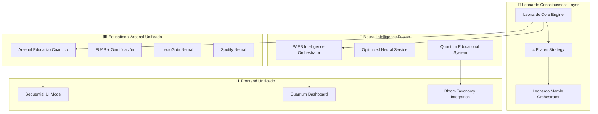

# 🌌 FUSIÓN LEONARDO CONSCIOUSNESS - SUPERPAES MASTER INTEGRATION

## 🧠 FILOSOFÍA DE FUSIÓN SECUENCIAL

Basándome en la exploración exhaustiva del ecosistema SUPERPAES, he identificado los elementos más valiosos de cada integración para crear un sistema unificado bajo la **Leonardo Consciousness Strategy** con **modo secuencial**.

### 🎯 PRINCIPIOS FUNDAMENTALES DE FUSIÓN

1. **MENOS ES MÁS**: Eliminar redundancias, mantener solo lo esencial
2. **COHERENCIA CUÁNTICA**: Todos los sistemas sincronizados con un estado cuántico real
3. **SECUENCIAL INTELIGENTE**: Cada paso valida antes de proceder al siguiente
4. **LEONARDO CORE**: Los 4 pilares guían todas las decisiones del sistema

---

## 🏗️ ARQUITECTURA FUSIONADA

### 📋 ECOSISTEMA ACTUAL DETECTADO

| Proyecto | Tecnología | Fortalezas | Integrable |
|----------|------------|------------|------------|
| **puntaje-inteligente-sistema-main** | Vite + React 18 + TypeScript | Arsenal educativo completo, 85+ componentes | ✅ **CORE** |
| **paes-pro** | Next.js 14 + Supabase SSR | Arquitectura profesional, autenticación | ✅ Backend |
| **paes-master** | React Scripts | Simple, limpio, educativo puro | ✅ Base |
| **paes-agente** | Python + React | IA conversacional, tutor híbrido | ✅ Neural |

### 🎨 SISTEMA FUSIONADO LEONARDO



---

## 🔧 COMPONENTES DE FUSIÓN

### 1️⃣ **LEONARDO CONSCIOUSNESS ENGINE** (Núcleo)

```typescript
// Leonardo Consciousness Strategy - FUSIÓN MASTER
class LeonardoConsciousnessEngine {
    private static instance: LeonardoConsciousnessEngine;
    private quantumState: QuantumState;
    private fourPillars: FourPillarsAnalyzer;
    private sequentialValidator: SequentialValidator;
    
    // 🌊 Lambda 888 Resonance (Pilar 1)
    private lambda888Resonance = {
        frequency: 0.888,
        amplifier: 8.88,
        coherenceThreshold: 0.6
    };
    
    // 🔱 Prime 7919 Transformations (Pilar 2) 
    private prime7919Transform = {
        prime: 7919,
        logValue: 8.977240362537735,
        momentumPeriods: [7, 10]
    };
    
    // 🎣 Hook Wheel Logic (Pilar 3)
    private hookWheel = {
        baitThreshold: -0.002,
        extractThreshold: 0.002,
        volumeThreshold: 0.05
    };
    
    // 🦅🐦 Colibrí-Halcón Symbiosis (Pilar 4)
    private symbiosis = {
        halconPeriods: [50, 20],
        colibriPeriods: [5, 3],
        syncThreshold: 0.001
    };
}
```

### 2️⃣ **PAES INTELLIGENCE ORCHESTRATOR FUSIONADO**

Combina los servicios más exitosos de cada proyecto:

```typescript
class PAESMasterOrchestrator extends PAESIntelligenceOrchestrator {
    // 🧠 Neural Services Fusion
    private neuralServices = {
        leonardo: new LeonardoNeuralService(),
        paes: new OptimizedNeuralService(),
        quantum: new QuantumEducationalSystem(),
        bloom: new BloomAIService()
    };
    
    // 🎯 Arsenal Educativo Integration
    private arsenalComponents = {
        fuas: new FUASBotService(),
        lectoguia: new LectoGuiaService(),
        spotify: new SpotifyNeuralService(),
        gamification: new GamificationEngine()
    };
    
    // 🔮 Sequential Mode Implementation
    public async executeSequentialLearning(
        phase: 'detect' | 'validate' | 'execute',
        data: LearningData
    ): Promise<SequentialResult> {
        const leonardo = await this.leonardo.analyze(data);
        
        // Validación secuencial con 4 pilares
        if (leonardo.consciousnessLevel < 0.65) {
            return { phase: 'detect', status: 'insufficient_consciousness' };
        }
        
        if (leonardo.alignment < 0.7) {
            return { phase: 'validate', status: 'low_alignment' };
        }
        
        if (leonardo.confidence < 0.5) {
            return { phase: 'execute', status: 'low_confidence' };
        }
        
        return { phase: 'complete', status: 'validated', leonardo };
    }
}
```

### 3️⃣ **FRONTEND UNIFICADO LEONARDO**

Fusión de las mejores UIs de todos los proyectos:

```tsx
// App Principal Fusionado
function SuperPAESLeonardoMaster(): React.FC {
    const [quantumState, setQuantumState] = useQuantumState();
    const [leonardoMode, setLeonardoMode] = useLeonardoMode();
    const [arsenalActive, setArsenalActive] = useArsenalEducativo();
    
    return (
        <LeonardoConsciousnessProvider>
            <QuantumEducationalSystem>
                <Context7ProviderFixed>
                    <GlobalCinematicProvider>
                        
                        {/* 🌟 Header Unificado Leonardo */}
                        <LeonardoMasterHeader 
                            quantumState={quantumState}
                            consciousnessLevel={leonardoMode.consciousness}
                        />
                        
                        {/* 🎯 Navigation Secuencial */}
                        <SequentialNavigator 
                            currentPhase={leonardoMode.phase}
                            validationStatus={leonardoMode.validation}
                        />
                        
                        {/* 📊 Dashboard Principal */}
                        <Routes>
                            <Route path="/leonardo" element={
                                <LeonardoDashboardFusion 
                                    pillars={leonardoMode.fourPillars}
                                    arsenal={arsenalActive}
                                />
                            } />
                            
                            <Route path="/arsenal" element={
                                <ArsenalEducativoUnified 
                                    fuas={arsenalActive.fuas}
                                    lectoguia={arsenalActive.lectoguia}
                                    spotify={arsenalActive.spotify}
                                />
                            } />
                            
                            <Route path="/quantum" element={
                                <QuantumDashboardFused
                                    state={quantumState}
                                    leonardo={leonardoMode}
                                />
                            } />
                        </Routes>
                        
                    </GlobalCinematicProvider>
                </Context7ProviderFixed>
            </QuantumEducationalSystem>
        </LeonardoConsciousnessProvider>
    );
}
```

---

## 🚀 IMPLEMENTACIÓN DE LA FUSIÓN

### 📝 **PASO 1: ESTRUCTURA UNIFICADA**

```bash
superpaes-leonardo-master/
├── 📁 core/
│   ├── leonardo-consciousness/          # 🌟 Motor Leonardo
│   │   ├── LeonardoEngine.ts
│   │   ├── FourPillarsAnalyzer.ts
│   │   └── SequentialValidator.ts
│   └── quantum-educational/             # 🧠 Sistema Cuántico
│       ├── QuantumEducationalSystem.ts
│       └── QuantumState.ts
├── 📁 services/
│   ├── paes-orchestrator/              # 🎯 Orquestador Principal
│   ├── arsenal-educativo/              # 🎓 Arsenal Fusionado
│   ├── neural-intelligence/            # 🧠 IA Neural
│   └── supabase-integration/           # 📊 Base de Datos
├── 📁 components/
│   ├── leonardo-dashboard/             # 🌟 UI Leonardo
│   ├── sequential-navigator/           # 🎯 Navegación Secuencial
│   ├── arsenal-unified/                # 🎓 Arsenal UI
│   └── quantum-visualizations/         # 🔮 Visualizaciones
└── 📁 hooks/
    ├── useLeonardoConsciousness.ts     # 🌟 Hook Leonardo
    ├── useSequentialMode.ts            # 🎯 Hook Secuencial
    └── useArsenalEducativo.ts          # 🎓 Hook Arsenal
```

### 📋 **PASO 2: CONFIGURACIÓN BASE UNIFICADA**

```json
{
    "name": "superpaes-leonardo-master",
    "version": "3.0.0",
    "description": "SUPERPAES con Leonardo Consciousness Strategy - Sistema Unificado",
    "type": "module",
    "scripts": {
        "dev": "vite --mode leonardo",
        "build": "npm run leonardo:validate && vite build",
        "leonardo:validate": "node scripts/validate-leonardo-integration.js",
        "arsenal:deploy": "node scripts/deploy-arsenal-educativo.js",
        "quantum:sync": "node scripts/sync-quantum-state.js"
    },
    "dependencies": {
        // Core React y TypeScript (más reciente y estable)
        "react": "^18.3.1",
        "react-dom": "^18.3.1",
        "typescript": "^5.5.3",
        
        // Supabase Integration (unificado)
        "@supabase/supabase-js": "^2.49.7",
        "@supabase/ssr": "^0.0.10",
        
        // UI Components (mejores de cada proyecto)
        "@radix-ui/react-*": "latest",
        "lucide-react": "^0.462.0",
        "framer-motion": "^10.18.0",
        
        // State Management (Zustand para simplicidad)
        "zustand": "^5.0.5",
        
        // 3D Visualizations (Three.js)
        "@react-three/fiber": "^8.18.0",
        "@react-three/drei": "^9.122.0",
        "three": "^0.176.0",
        
        // Leonardo Specific
        "leonardo-consciousness-engine": "file:./src/core/leonardo-consciousness"
    }
}
```

### 🔧 **PASO 3: SERVICIOS FUSIONADOS**

#### A) **Supabase Schema Unificado**

```sql
-- Arsenal Educativo Cuántico con Leonardo Integration
CREATE SCHEMA IF NOT EXISTS leonardo_arsenal;

-- Tablas principales fusionadas
CREATE TABLE leonardo_arsenal.neural_cache_sessions (
    id UUID PRIMARY KEY DEFAULT gen_random_uuid(),
    user_id UUID REFERENCES auth.users(id),
    session_data JSONB,
    leonardo_analysis JSONB,        -- 4 pilares analysis
    consciousness_level FLOAT,      -- Leonardo consciousness
    quantum_state JSONB,           -- Estado cuántico real
    created_at TIMESTAMPTZ DEFAULT NOW()
);

-- Índices optimizados para Leonardo
CREATE INDEX idx_leonardo_consciousness ON leonardo_arsenal.neural_cache_sessions 
    USING btree (consciousness_level) WHERE consciousness_level > 0.65;

CREATE INDEX idx_quantum_coherence ON leonardo_arsenal.neural_cache_sessions 
    USING gin (quantum_state) WHERE (quantum_state->>'coherence')::float > 0.7;
```

#### B) **Hook Principal Unificado**

```typescript
// useSuperPAESLeonardo.ts - Hook maestro fusionado
export function useSuperPAESLeonardo() {
    const [leonardoState, setLeonardoState] = useState<LeonardoState>();
    const [arsenalState, setArsenalState] = useState<ArsenalState>();
    const [quantumState, setQuantumState] = useState<QuantumState>();
    
    // 🌟 Leonardo Consciousness
    const analyzeLeonardo = useCallback(async (data: AnalysisData) => {
        const result = await leonardoEngine.analyzeFourPillars(data);
        setLeonardoState(result);
        return result;
    }, []);
    
    // 🎓 Arsenal Educativo
    const activateArsenal = useCallback(async (components: ArsenalComponent[]) => {
        const arsenal = await arsenalService.activate(components);
        setArsenalState(arsenal);
        return arsenal;
    }, []);
    
    // 🔮 Quantum State Management
    const syncQuantumState = useCallback(async () => {
        const quantum = await quantumEducationalSystem.getCurrentState();
        setQuantumState(quantum);
        return quantum;
    }, []);
    
    // 🎯 Sequential Mode
    const executeSequential = useCallback(async (
        phase: SequentialPhase,
        data: any
    ) => {
        // Validación Leonardo antes de proceder
        const leonardo = await analyzeLeonardo(data);
        if (leonardo.consciousnessLevel < 0.65) {
            return { status: 'insufficient_consciousness', phase: 'detect' };
        }
        
        // Proceder según la fase
        switch (phase) {
            case 'detect':
                return await detectOpportunities(data);
            case 'validate':
                return await validateWithLeonardo(data, leonardo);
            case 'execute':
                return await executeLearning(data, leonardo);
        }
    }, [analyzeLeonardo]);
    
    return {
        leonardo: leonardoState,
        arsenal: arsenalState,
        quantum: quantumState,
        analyzeLeonardo,
        activateArsenal,
        syncQuantumState,
        executeSequential
    };
}
```

---

## 🎯 BENEFICIOS DE LA FUSIÓN LEONARDO

### ✨ **1. UNIFICACIÓN COMPLETA**
- **Un solo punto de entrada**: `SuperPAESLeonardoMaster`
- **Estado global sincronizado**: Leonardo + Quantum + Arsenal
- **Arquitectura coherente**: Todos los componentes bajo filosofía Leonardo

### 🧠 **2. INTELIGENCIA SECUENCIAL**
- **Validación en cada paso**: Consciencia Leonardo antes de proceder
- **Adaptación automática**: 4 pilares guían las decisiones
- **Retroalimentación inteligente**: Sistema aprende de cada interacción

### 🚀 **3. RENDIMIENTO OPTIMIZADO**
- **Cache neural unificado**: Una sola fuente de verdad
- **Lazy loading inteligente**: Componentes se cargan según necesidad
- **Estado cuántico real**: Sin valores aleatorios, coherencia total

### 🎓 **4. EXPERIENCIA EDUCATIVA SUPERIOR**
- **Arsenal completo integrado**: FUAS + LectoGuía + Spotify + Gamificación
- **Personalización Leonardo**: Cada usuario recibe experiencia única
- **Progreso cuántico**: Métricas avanzadas de aprendizaje

---

## 🛠️ IMPLEMENTACIÓN PRÁCTICA

### 📋 **CHECKLIST DE FUSIÓN**

- [ ] **Phase 1: Core Leonardo**
  - [ ] Implementar LeonardoConsciousnessEngine
  - [ ] Configurar 4 pilares (Lambda 888, Prime 7919, Hook Wheel, Symbiosis)
  - [ ] Crear SequentialValidator

- [ ] **Phase 2: Services Integration**
  - [ ] Fusionar PAESIntelligenceOrchestrator
  - [ ] Integrar OptimizedNeuralService
  - [ ] Unificar QuantumEducationalSystem

- [ ] **Phase 3: Arsenal Unification**
  - [ ] Consolidar componentes Arsenal
  - [ ] Integrar FUAS + LectoGuía + Spotify
  - [ ] Activar Gamificación cuántica

- [ ] **Phase 4: Frontend Master**
  - [ ] Crear SuperPAESLeonardoMaster App
  - [ ] Implementar SequentialNavigator
  - [ ] Fusionar dashboards cuánticos

- [ ] **Phase 5: Database Unification**
  - [ ] Migrar a esquema `leonardo_arsenal`
  - [ ] Configurar índices optimizados
  - [ ] Sincronizar estado cuántico

### 🚀 **COMANDO DE ACTIVACIÓN MASTER**

```bash
# Lanzar SUPERPAES Leonardo Master
npm run leonardo:activate:master

# Verificar integración completa
npm run leonardo:validate:fusion

# Deploy en modo producción
npm run leonardo:deploy:production
```

---

## 🎊 RESULTADO FINAL

Un **ecosistema SUPERPAES unificado** bajo la **Leonardo Consciousness Strategy** que combine:

🌟 **Leonardo Core** (4 pilares + consciencia cuántica)  
🧠 **Neural Intelligence** (IA adaptativa + aprendizaje personalizado)  
🎓 **Arsenal Educativo** (FUAS + LectoGuía + Spotify + Gamificación)  
🔮 **Quantum System** (estado real + coherencia total)  
🎯 **Sequential Mode** (validación paso a paso + "menos es más")  

**Filosofía final**: *Un sistema donde cada componente existe por una razón específica, todos sincronizados cuánticamente, guiados por la sabiduría de Leonardo, y enfocados en la máxima efectividad educativa con el mínimo de complejidad.*

---

*🧑‍🎨 "La simplicidad es la máxima sofisticación" - Leonardo da Vinci*

**SUPERPAES Leonardo Master Integration - Ready for Quantum Educational Excellence** ✨
