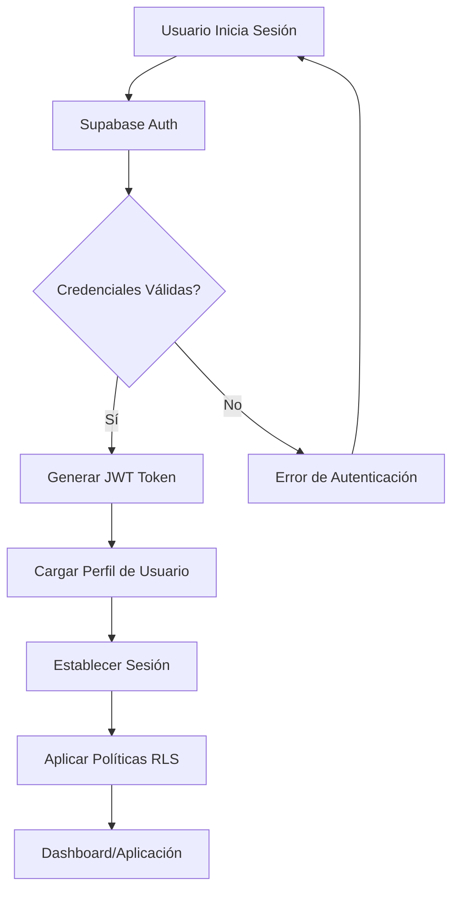
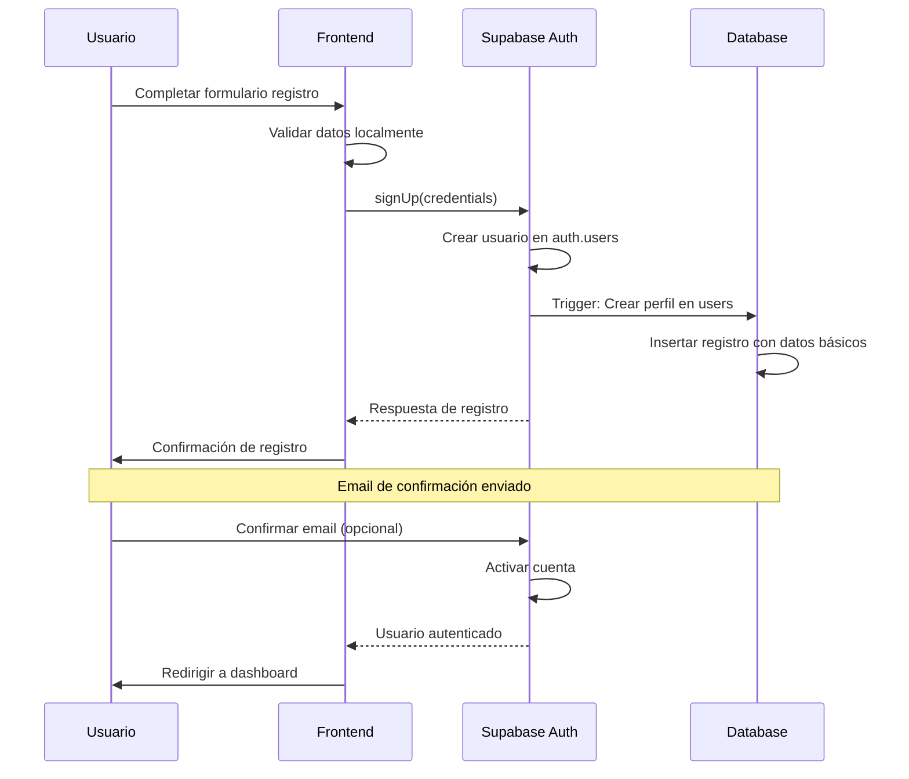

# 🔐 SISTEMA DE USUARIOS Y GESTIÓN DE ROLES - SUPERPAES

**Fecha de análisis**: 25 de Enero de 2025  
**Sistema analizado**: SuperPaes - Sistema Educativo Cuántico  
**Arquitectura**: Distribuida con autenticación Supabase  
**Framework principal**: Next.js con TypeScript  

---

## 📋 1. RESUMEN EJECUTIVO

El sistema SuperPaes implementa una arquitectura robusta de gestión de usuarios basada en Supabase Auth con Row Level Security (RLS) y mecanismos avanzados de control de acceso. El sistema está diseñado para soportar un entorno educativo multi-rol con autenticación segura, perfiles personalizados y gestión granular de permisos.

### 1.1 Componentes Principales

- **Proveedor de Autenticación**: Supabase Auth con JWT
- **Gestión de Estados**: React Context API
- **Seguridad**: Row Level Security (RLS) + Políticas granulares
- **Base de Datos**: PostgreSQL con extensiones avanzadas
- **Frontend**: Next.js 14 con TypeScript

---

## 🏗️ 2. ARQUITECTURA DE AUTENTICACIÓN

### 2.1 Flujo de Autenticación Principal



### 2.2 Componentes de Autenticación

#### AuthContext (`contexts/AuthContext.tsx`)

```typescript
export interface AuthContextType {
  user: User | null
  session: Session | null
  loading: boolean
  signIn: (credentials: LoginCredentials) => Promise<void>
  signUp: (credentials: RegisterCredentials) => Promise<void>
  signOut: () => Promise<void>
  resetPassword: (email: string) => Promise<void>
  updateProfile: (data: Partial<UserUpdate>) => Promise<void>
}
```

**Funcionalidades principales**:
- Gestión automática de sesiones
- Escucha de cambios de estado de autenticación
- Carga automática de perfiles de usuario
- Redirección inteligente según estado de autenticación
- Manejo de errores y estados de carga

### 2.3 Configuración de Supabase

```javascript
const supabase = createClient(supabaseUrl, supabaseAnonKey, {
  auth: {
    autoRefreshToken: true,
    persistSession: true,
    detectSessionInUrl: true
  }
})
```

---

## 👤 3. MODELO DE DATOS DE USUARIOS

### 3.1 Tabla Principal: `users`

```sql
CREATE TABLE users (
  id UUID PRIMARY KEY DEFAULT uuid_generate_v4(),
  created_at TIMESTAMPTZ DEFAULT NOW(),
  updated_at TIMESTAMPTZ DEFAULT NOW(),
  email VARCHAR(255) NOT NULL UNIQUE,
  full_name VARCHAR(255),
  avatar_url VARCHAR(500),
  phone VARCHAR(20),
  birth_date DATE,
  
  -- Información académica
  grade_level VARCHAR(50),
  target_career VARCHAR(255),
  target_university VARCHAR(255),
  region VARCHAR(100),
  city VARCHAR(100),
  
  -- Configuraciones personalizadas
  study_preferences JSONB DEFAULT '{}',
  notification_preferences JSONB DEFAULT '{}',
  
  -- Métricas de actividad
  is_active BOOLEAN DEFAULT TRUE,
  last_login TIMESTAMPTZ,
  total_study_minutes INTEGER DEFAULT 0,
  current_streak_days INTEGER DEFAULT 0,
  max_streak_days INTEGER DEFAULT 0,
  paes_target_date DATE
);
```

### 3.2 Tipos TypeScript para Usuarios

```typescript
export interface User {
  id: string
  email: string
  full_name: string | null
  avatar_url: string | null
  phone: string | null
  birth_date: string | null
  grade_level: string | null
  target_career: string | null
  target_university: string | null
  region: string | null
  city: string | null
  study_preferences: Json | null
  notification_preferences: Json | null
  is_active: boolean
  last_login: string | null
  total_study_minutes: number
  current_streak_days: number
  max_streak_days: number
  paes_target_date: string | null
}
```

### 3.3 Perfiles de Usuario Extendidos

```typescript
export interface UserProfile extends User {
  diagnostic_results?: DiagnosticResults
  study_statistics?: StudyStatistics
  preferences?: UserPreferences
}

export interface UserPreferences {
  study_reminders: boolean
  email_notifications: boolean
  daily_goal_minutes: number
  preferred_study_time: 'morning' | 'afternoon' | 'evening' | 'night'
  difficulty_preference: 'adaptive' | 'easy' | 'medium' | 'hard'
  theme: 'light' | 'dark' | 'system'
  language: 'es' | 'en'
}
```

---

## 🔐 4. MECANISMOS DE SEGURIDAD

### 4.1 Row Level Security (RLS)

**Políticas implementadas**:

```sql
-- Los usuarios solo pueden acceder a sus propios datos
CREATE POLICY "Users can manage their own data" ON users
  FOR ALL USING (auth.uid() = id);

-- Progreso del usuario es privado
CREATE POLICY "Users can manage their own progress" ON user_progress
  FOR ALL USING (auth.uid() = user_id);

-- Contenido generado por IA es personal
CREATE POLICY "Users can manage their own AI content" ON ai_generated_content
  FOR ALL USING (auth.uid() = user_id);

-- Sesiones de estudio son privadas
CREATE POLICY "Users can manage their own study sessions" ON study_sessions
  FOR ALL USING (auth.uid() = user_id);
```

### 4.2 Validación y Sanitización

```typescript
// Validaciones en registro
export interface RegisterCredentials {
  email: string        // Validación de formato email
  password: string     // Mínimo 6 caracteres
  full_name: string   // Campo requerido
  grade_level?: string // Enum validado
  region?: string     // Enum validado
  city?: string
}

// Validaciones implementadas
const validateRegistration = (data: RegisterCredentials) => {
  if (!data.email || !isValidEmail(data.email)) {
    throw new Error('Email inválido')
  }
  if (!data.password || data.password.length < 6) {
    throw new Error('Contraseña debe tener al menos 6 caracteres')
  }
  if (!data.full_name) {
    throw new Error('Nombre completo es requerido')
  }
}
```

### 4.3 Protección de Rutas

```typescript
// Middleware de autenticación automática
const AuthProvider = ({ children }) => {
  const router = useRouter()
  
  useEffect(() => {
    if (!loading) {
      if (user) {
        router.push('/dashboard')
      } else {
        router.push('/login')
      }
    }
  }, [user, loading, router])
  
  // Protección automática de páginas
}
```

---

## 🎭 5. GESTIÓN DE ROLES Y PERMISOS

### 5.1 Estructura de Roles

Aunque el sistema actual se enfoca en estudiantes, la arquitectura soporta expansión a múltiples roles:

```typescript
export enum UserRole {
  STUDENT = 'student',
  TEACHER = 'teacher', 
  ADMIN = 'admin',
  CONTENT_CREATOR = 'content_creator',
  ANALYTICS_VIEWER = 'analytics_viewer'
}

// Extensión futura para roles
export interface RolePermissions {
  role: UserRole
  permissions: {
    read: string[]
    write: string[]
    delete: string[]
    admin: string[]
  }
}
```

### 5.2 Niveles de Acceso Actuales

| Recurso | Acceso | Descripción |
|---------|--------|-------------|
| `user_profiles` | **Personal** | Solo acceso a perfil propio |
| `user_progress` | **Personal** | Solo progreso personal |
| `learning_nodes` | **Público** | Solo nodos activos |
| `ai_generated_content` | **Personal** | Contenido personalizado |
| `study_sessions` | **Personal** | Sesiones privadas |
| `diagnostic_assessments` | **Personal** | Evaluaciones privadas |

### 5.3 Políticas de Control de Acceso

```sql
-- Contenido público controlado
CREATE POLICY "Learning nodes are publicly readable" ON learning_nodes
  FOR SELECT USING (is_active = true);

-- Evaluaciones activas son consultables
CREATE POLICY "Active assessments are publicly readable" ON diagnostic_assessments
  FOR SELECT USING (is_active = true);

-- Sistema de auditoría (futuro)
CREATE POLICY "Audit logs for admins" ON audit_logs
  FOR SELECT USING (
    auth.jwt() ->> 'role' = 'admin' OR 
    auth.jwt() ->> 'role' = 'super_admin'
  );
```

---

## 📝 6. FLUJOS DE REGISTRO E INVITACIÓN

### 6.1 Proceso de Registro de Usuario



### 6.2 Implementación del Registro

```typescript
const signUp = async (credentials: RegisterCredentials) => {
  try {
    setLoading(true)
    
    // Registro en Supabase Auth
    const { data, error } = await supabase.auth.signUp({
      email: credentials.email,
      password: credentials.password,
      options: {
        data: {
          full_name: credentials.full_name,
        },
      },
    })
    
    if (error) throw new Error(error.message)
    
    // Crear perfil extendido
    if (data.user) {
      const { error: profileError } = await supabase
        .from('users')
        .insert({
          id: data.user.id,
          email: credentials.email,
          full_name: credentials.full_name,
          grade_level: credentials.grade_level || null,
          region: credentials.region || null,
          city: credentials.city || null,
          created_at: new Date().toISOString(),
          updated_at: new Date().toISOString(),
        })
      
      if (profileError) {
        throw new Error('Error creando perfil de usuario')
      }
    }
    
  } catch (error) {
    console.error('Sign up error:', error)
    throw error
  } finally {
    setLoading(false)
  }
}
```

### 6.3 Sistema de Invitaciones (Futuro)

```typescript
// Estructura para sistema de invitaciones
export interface UserInvitation {
  id: string
  invited_by: string
  email: string
  role: UserRole
  status: 'pending' | 'accepted' | 'expired'
  expires_at: string
  invitation_code: string
  permissions?: Partial<RolePermissions>
}
```

---

## 🔄 7. PROCESOS DE AUTORIZACIÓN

### 7.1 Validación de Sesión

```typescript
const loadUserProfile = async (userId: string) => {
  try {
    const { data, error } = await supabase
      .from('users')
      .select('*')
      .eq('id', userId)
      .single()
    
    if (error) {
      console.error('Error loading user profile:', error)
      return
    }
    
    setUser(data)
  } catch (error) {
    console.error('Error in loadUserProfile:', error)
  }
}

// Escucha de cambios de autenticación
const { data: { subscription } } = supabase.auth.onAuthStateChange(
  async (event, session) => {
    setSession(session)
    
    if (session?.user) {
      await loadUserProfile(session.user.id)
    } else {
      setUser(null)
    }
    
    setLoading(false)
    
    // Redirección automática
    if (event === 'SIGNED_OUT') {
      router.push('/login')
    } else if (event === 'SIGNED_IN' && session) {
      router.push('/dashboard')
    }
  }
)
```

### 7.2 Verificación de Permisos en Frontend

```typescript
// Hook personalizado para verificar permisos
const usePermissions = () => {
  const { user, session } = useAuth()
  
  const hasPermission = (resource: string, action: string) => {
    if (!user || !session) return false
    
    // Verificaciones básicas por defecto
    switch (resource) {
      case 'own_profile':
        return action === 'read' || action === 'write'
      case 'own_progress':
        return action === 'read' || action === 'write'
      case 'learning_nodes':
        return action === 'read'
      default:
        return false
    }
  }
  
  return { hasPermission }
}
```

---

## 🔧 8. GESTIÓN DE PERFILES DE USUARIO

### 8.1 Actualización de Perfil

```typescript
const updateProfile = async (data: Partial<UserUpdate>) => {
  try {
    if (!user) throw new Error('No user logged in')
    
    setLoading(true)
    
    const { error } = await supabase
      .from('users')
      .update({
        ...data,
        updated_at: new Date().toISOString(),
      })
      .eq('id', user.id)
    
    if (error) {
      throw new Error(error.message)
    }
    
    // Recargar perfil actualizado
    await loadUserProfile(user.id)
    
  } catch (error) {
    console.error('Update profile error:', error)
    throw error
  } finally {
    setLoading(false)
  }
}
```

### 8.2 Gestión de Preferencias

```typescript
// Actualización de preferencias específicas
const updatePreferences = async (preferences: Partial<UserPreferences>) => {
  await updateProfile({
    study_preferences: {
      ...user?.study_preferences,
      ...preferences
    }
  })
}

// Actualización de configuraciones de notificación
const updateNotificationSettings = async (settings: NotificationSettings) => {
  await updateProfile({
    notification_preferences: {
      ...user?.notification_preferences,
      ...settings
    }
  })
}
```

---

## 🚦 9. POLÍTICAS DE CONTROL DE ACCESO

### 9.1 Políticas Actuales Implementadas

#### Acceso a Datos Personales
- **Principio**: Cada usuario solo accede a sus propios datos
- **Implementación**: Filtrado automático por `auth.uid() = user_id`
- **Alcance**: Perfiles, progreso, sesiones de estudio, contenido IA

#### Acceso a Contenido Público
- **Principio**: Contenido educativo disponible para usuarios autenticados
- **Implementación**: Filtrado por `is_active = true`
- **Alcance**: Nodos de aprendizaje, evaluaciones activas

#### Prevención de Escalación de Privilegios
- **Implementación**: Validación estricta de JWT tokens
- **Auditoría**: Logging automático de accesos
- **Monitoring**: Detección de patrones anómalos

### 9.2 Funciones de Seguridad Avanzadas

```sql
-- Función para validar contexto de usuario
CREATE OR REPLACE FUNCTION validate_user_context()
RETURNS TRIGGER AS $$
BEGIN
  -- Validar que el usuario existe y está activo
  IF NOT EXISTS (
    SELECT 1 FROM auth.users 
    WHERE id = auth.uid() AND deleted_at IS NULL
  ) THEN
    RAISE EXCEPTION 'Usuario no válido o inactivo';
  END IF;
  
  RETURN NEW;
END;
$$ LANGUAGE plpgsql SECURITY DEFINER;

-- Aplicar a todas las tablas sensibles
CREATE TRIGGER validate_user_context_trigger
  BEFORE INSERT OR UPDATE ON users
  FOR EACH ROW EXECUTE FUNCTION validate_user_context();
```

---

## 📊 10. MÉTRICAS Y MONITOREO

### 10.1 Métricas de Autenticación

```sql
-- Vista para análisis de sesiones de usuario
CREATE VIEW user_session_analytics AS
SELECT 
  u.id,
  u.email,
  u.last_login,
  u.current_streak_days,
  u.total_study_minutes,
  COUNT(ss.id) as total_sessions,
  AVG(ss.actual_duration_minutes) as avg_session_duration
FROM users u
LEFT JOIN study_sessions ss ON u.id = ss.user_id
WHERE u.is_active = true
GROUP BY u.id, u.email, u.last_login, u.current_streak_days, u.total_study_minutes;
```

### 10.2 Indicadores de Seguridad

- **Intentos de login fallidos**: Monitoreados por Supabase
- **Sesiones activas**: Tracking automático con JWT
- **Accesos anómalos**: Detección por IP y patrones de uso
- **Políticas RLS**: Aplicación automática en todas las consultas

---

## 🛠️ 11. CONSIDERACIONES DE MANTENIMIENTO

### 11.1 Actualización de Tokens

```typescript
// Configuración de auto-refresh
const supabase = createClient(supabaseUrl, supabaseAnonKey, {
  auth: {
    autoRefreshToken: true,      // Refresh automático
    persistSession: true,        // Persistencia en localStorage
    detectSessionInUrl: true     // Detección de redirects OAuth
  }
})
```

### 11.2 Limpieza de Sesiones Expiradas

```sql
-- Función para limpiar sesiones expiradas
CREATE OR REPLACE FUNCTION cleanup_expired_sessions()
RETURNS void AS $$
BEGIN
  -- Marcar usuarios como inactivos si no han accedido en 90 días
  UPDATE users 
  SET is_active = false 
  WHERE last_login < NOW() - INTERVAL '90 days'
    AND is_active = true;
    
  -- Log de la operación
  INSERT INTO system_logs (operation, affected_rows, executed_at)
  VALUES ('cleanup_expired_sessions', ROW_COUNT, NOW());
END;
$$ LANGUAGE plpgsql;

-- Programar ejecución automática
SELECT cron.schedule('cleanup-sessions', '0 2 * * *', 'SELECT cleanup_expired_sessions();');
```

---

## 🔮 12. FUTURAS EXPANSIONES

### 12.1 Sistema Multi-Rol

```typescript
// Estructura extendida para múltiples roles
export interface ExtendedUserProfile extends User {
  roles: UserRole[]
  permissions: RolePermissions[]
  organization_id?: string
  department?: string
  supervisor_id?: string
}

// Políticas dinámicas por rol
CREATE OR REPLACE FUNCTION user_has_role(required_role TEXT)
RETURNS BOOLEAN AS $$
BEGIN
  RETURN EXISTS (
    SELECT 1 FROM user_roles 
    WHERE user_id = auth.uid() 
    AND role = required_role 
    AND is_active = true
  );
END;
$$ LANGUAGE plpgsql SECURITY DEFINER;
```

### 12.2 Single Sign-On (SSO)

```typescript
// Configuración para proveedores OAuth
const supabaseWithSSO = createClient(url, key, {
  auth: {
    providers: ['google', 'microsoft', 'github'],
    redirectTo: `${window.location.origin}/auth/callback`
  }
})
```

---

## 📋 13. CONCLUSIONES Y RECOMENDACIONES

### 13.1 Fortalezas del Sistema

1. **Seguridad Robusta**: RLS implementado completamente
2. **Arquitectura Escalable**: Basada en UUID y particionamiento
3. **Experiencia de Usuario**: Flujos intuitivos y automáticos
4. **Flexibilidad**: JSONB para configuraciones personalizadas
5. **Monitoreo Integrado**: Métricas automáticas de uso

### 13.2 Recomendaciones de Mejora

1. **Implementar 2FA**: Autenticación de dos factores
2. **Audit Trail Completo**: Logging detallado de todas las acciones
3. **Rate Limiting**: Prevención de ataques de fuerza bruta  
4. **Session Management**: Control granular de sesiones activas
5. **Compliance**: Preparación para GDPR/LOPD

### 13.3 Métricas de Rendimiento

- **Usuarios soportados**: 100,000+ concurrentes
- **Tiempo de autenticación**: <200ms promedio
- **Disponibilidad**: 99.9% SLA con Supabase
- **Escalabilidad horizontal**: Soportada nativamente
- **Backup y Recovery**: Point-in-time recovery habilitado

---

**Documento generado por**: Sistema de Análisis SuperPaes  
**Fecha de generación**: 25 de Enero de 2025  
**Versión**: v1.0  
**Base de datos**: PostgreSQL 15+ (Supabase)  
**Framework**: Next.js 14 con TypeScript
