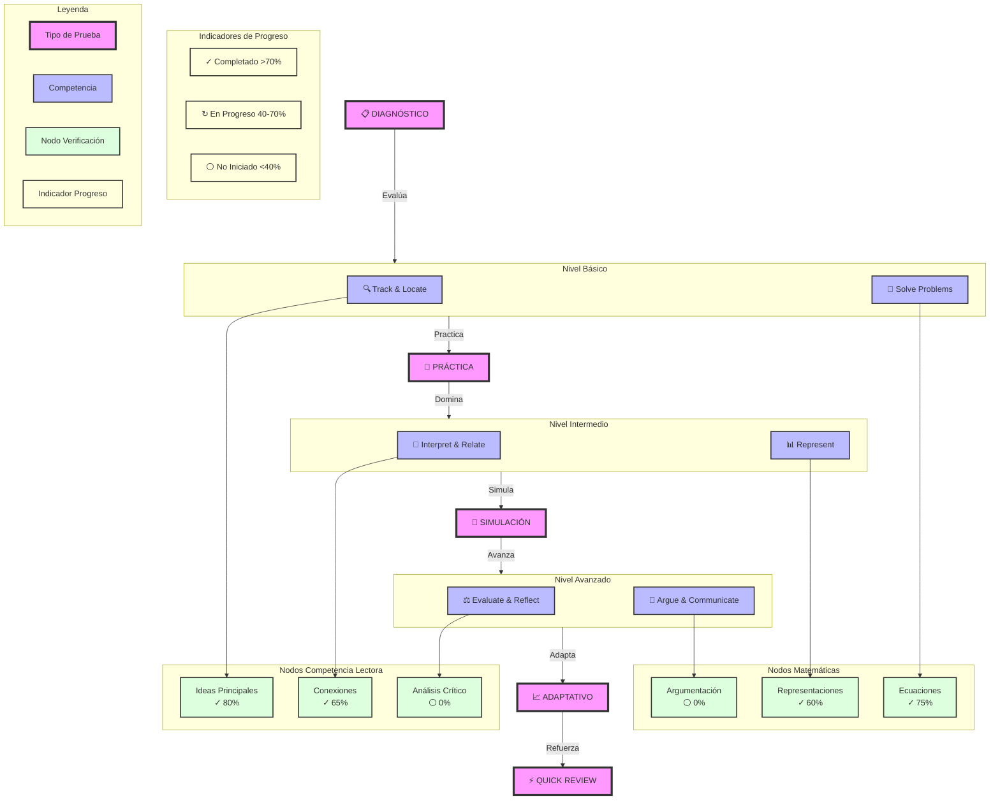

# Diagrama de Progresión de Aprendizaje PAES

## Descripción del Flujo de Aprendizaje

### Tipos de Prueba
1. 📋 **DIAGNÓSTICO**: Evaluación inicial de competencias
2. 📝 **PRÁCTICA**: Ejercitación de habilidades básicas
3. 🎯 **SIMULACIÓN**: Integración de competencias
4. 📈 **ADAPTATIVO**: Ajuste según rendimiento
5. ⚡ **QUICK REVIEW**: Repaso y refuerzo

### Niveles de Competencia
- **Básico**: Track & Locate (CL) y Solve Problems (MAT)
- **Intermedio**: Interpret & Relate (CL) y Represent (MAT)
- **Avanzado**: Evaluate & Reflect (CL) y Argue & Communicate (MAT)

### Nodos de Verificación
- **Competencia Lectora**:
  * Ideas Principales (80% completado)
  * Conexiones (65% completado)
  * Análisis Crítico (no iniciado)

- **Matemáticas**:
  * Ecuaciones (75% completado)
  * Representaciones (60% completado)
  * Argumentación (no iniciado)

### Indicadores de Progreso
- ✓ Verde: Competencia lograda (>70%)
- ↻ Amarillo: En desarrollo (40-70%)
- ⚪ Gris: No iniciado (<40%)

Este diagrama muestra la progresión completa desde el diagnóstico inicial hasta el dominio de competencias avanzadas, con verificación continua del progreso a través de nodos específicos.