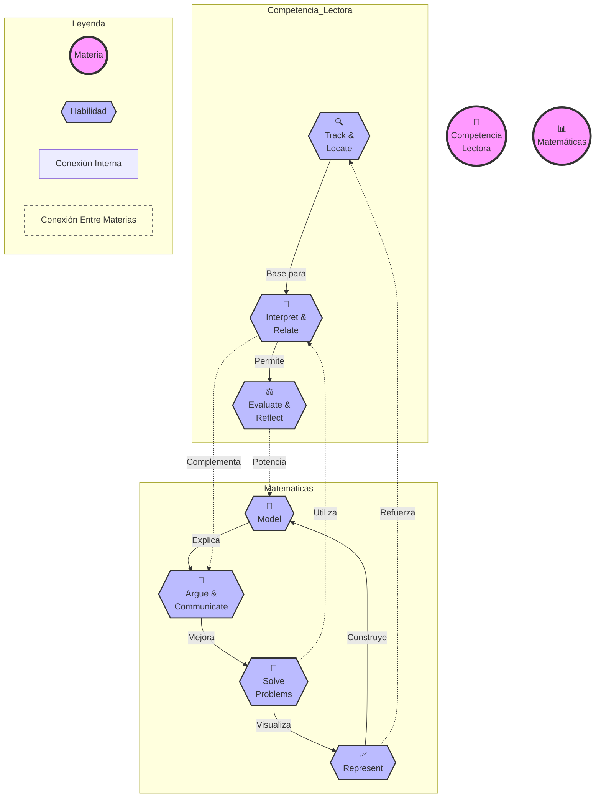

# Diagrama Visual de Habilidades PAES

## Descripción de Relaciones

### Competencia Lectora
- 🔍 Track & Locate: Habilidad base para identificar información
- 🔄 Interpret & Relate: Construye sobre la información localizada
- ⚖️ Evaluate & Reflect: Análisis profundo y evaluación

### Matemáticas
- 🧮 Solve Problems: Punto de partida para resolución
- 📈 Represent: Visualización y representación de problemas
- 🎯 Model: Construcción de modelos matemáticos
- 💭 Argue & Communicate: Explicación y justificación

### Conexiones Entre Materias
1. Interpretación → Argumentación
2. Representación → Localización
3. Evaluación → Modelamiento
4. Resolución → Interpretación

Este diagrama muestra cómo las habilidades se interconectan y se refuerzan mutuamente, creando un ciclo de aprendizaje integrado.