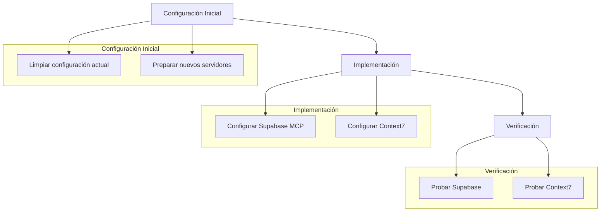

# Plan de Configuración de Servidores MCP

## Objetivo
Configurar los servidores MCP Supabase y Context7 en el proyecto, eliminando las configuraciones existentes no necesarias.

## Diagrama de Implementación


## Configuración a Implementar

### Nueva configuración para mcp_settings.json
```json
{
  "mcpServers": {
    "supabase": {
      "args": [
        "@supabase/mcp-server-supabase@latest",
        "--access-token",
        "sbp_bfe411debedab4304fb7ea825215de9d431ead68"
      ]
    },
    "context7": {
      "command": "npx",
      "args": [
        "-y",
        "@modelcontextprotocol/server-context7"
      ]
    }
  }
}
```

## Pasos de Implementación

1. Actualizar mcp_settings.json
   - Eliminar configuraciones existentes
   - Agregar configuración de Supabase con el token proporcionado
   - Agregar configuración de Context7

2. Verificación
   - Probar conexión con Supabase
   - Probar funcionamiento de Context7
   - Validar que no haya errores en la configuración

## Siguientes Pasos
Una vez aprobado este plan, se procederá a cambiar al modo Code para implementar los cambios en el archivo mcp_settings.json.