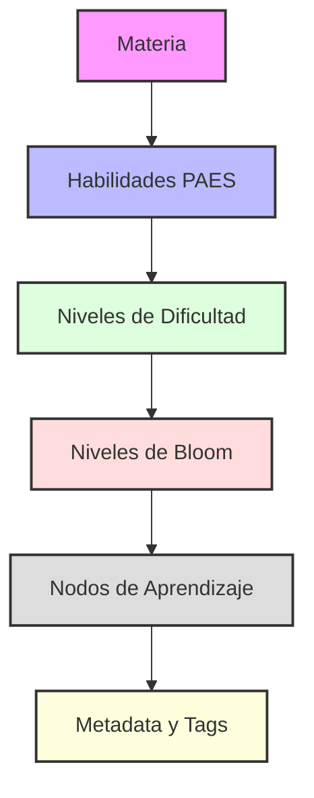

# Plan de Implementación CSV Jerárquico

## Estructura del CSV
```csv
Materia,Habilidad,Dificultad,Nivel_Bloom,Nodo_ID,Nodo_Nombre,Tiempo_Estimado,Prerequisitos,Tags,Tipo_Contenido,Descripcion,Metadata_Source,Metadata_Topic,Is_Active,Position
```

## Jerarquía Visual


## Descripción de Campos

1. **Campos Base**
   - Materia: COMPETENCIA_LECTORA, MATEMATICA_M1, MATEMATICA_M2, HISTORIA, CIENCIAS
   - Habilidad: TRACK_LOCATE, INTERPRET_RELATE, EVALUATE_REFLECT, SOLVE_PROBLEMS, etc.
   - Dificultad: BASICO, INTERMEDIO, AVANZADO
   - Nivel_Bloom: Recordar, Comprender, Aplicar, Analizar, Evaluar, Crear

2. **Campos de Nodo**
   - Nodo_ID: Identificador único del nodo
   - Nodo_Nombre: Nombre descriptivo del nodo
   - Tiempo_Estimado: Tiempo en minutos
   - Prerequisitos: Lista de IDs de nodos prerequisitos [node1;node2]

3. **Campos Extendidos**
   - Tags: Lista de etiquetas [tag1;tag2;tag3]
   - Tipo_Contenido: Tipo de contenido del nodo
   - Descripcion: Descripción detallada del nodo
   - Metadata_Source: Fuente del contenido
   - Metadata_Topic: Tema específico
   - Is_Active: Estado del nodo (true/false)
   - Position: Posición en la secuencia de aprendizaje

## Ejemplo de Contenido
```csv
COMPETENCIA_LECTORA,TRACK_LOCATE,BASICO,Recordar,node_1,Identificación de ideas principales,30,[node_2],[comprension;lectura],VIDEO,Ejercicios de identificación de ideas principales,PAES_2023,Comprensión Lectora,true,1
MATEMATICA_M1,SOLVE_PROBLEMS,INTERMEDIO,Aplicar,node_2,Resolución de ecuaciones lineales,45,[node_3;node_4],[algebra;ecuaciones],EJERCICIO,Práctica de resolución de ecuaciones de primer grado,PAES_2023,Álgebra,true,2
```

## Pasos de Implementación

1. Crear script para generar el CSV
2. Implementar validación de datos
3. Generar estructura jerárquica
4. Exportar a CSV
5. Validar formato y estructura

## Consideraciones Técnicas

- Usar UTF-8 para codificación
- Escapar caracteres especiales en campos
- Validar integridad de referencias (prerequisites)
- Mantener consistencia en formatos de listas