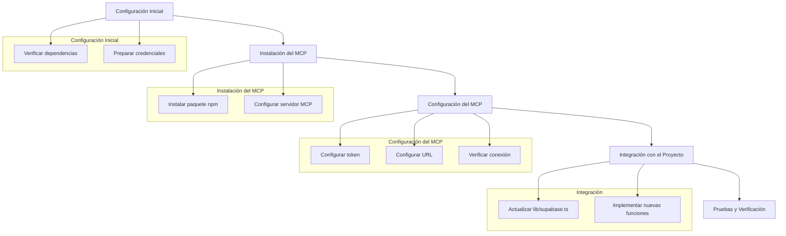

# Plan de Implementación del MCP de Supabase

## Descripción General
El MCP (Model Context Protocol) de Supabase nos permitirá integrar funcionalidades adicionales de Supabase en el proyecto paes-pro, facilitando la interacción con la base de datos y proporcionando herramientas adicionales para el manejo de datos.

## Pasos Detallados

### 1. Configuración Inicial
- Verificar que Node.js y npm estén instalados y actualizados
- Asegurar que el proyecto tenga las dependencias necesarias
- Tener a mano las credenciales de Supabase:
  - URL: https://settifboilityelprvjd.supabase.co
  - Token de acceso configurado

### 2. Instalación del MCP
- Instalar el paquete MCP de Supabase usando npx
- Configurar el servidor MCP en el proyecto
- Actualizar el archivo de configuración del MCP

### 3. Configuración del MCP
- Configurar el token de acceso en el servidor MCP
- Establecer la URL de Supabase
- Verificar la conexión con el servidor de Supabase

### 4. Integración con el Proyecto
- Actualizar el archivo `lib/supabase.ts` para incluir las nuevas funcionalidades del MCP
- Implementar nuevas funciones que aprovechen las capacidades del MCP
- Documentar los cambios y nuevas funcionalidades

### 5. Pruebas y Verificación
- Probar la conexión con el servidor MCP
- Verificar que las funciones existentes sigan funcionando
- Probar las nuevas funcionalidades implementadas

## Archivos a Modificar
1. `lib/supabase.ts` - Actualización de la configuración y nuevas funciones
2. Archivo de configuración del MCP
3. Posibles actualizaciones en archivos que consumen las funciones de Supabase