# Jerarquía de Aprendizaje PAES

## Estructura Visual

```mermaid
graph TD
    %% Tipos de Prueba
    TP[Tipos de Prueba] --> DIAG[Diagnóstico]
    TP --> PRAC[Práctica]
    TP --> SIM[Simulación]
    TP --> ADAP[Adaptativo]
    TP --> QR[Repaso Rápido]

    %% Habilidades principales por materia
    CL[Competencia Lectora] --> TL[Track & Locate]
    CL --> IR[Interpret & Relate]
    CL --> ER[Evaluate & Reflect]

    MAT[Matemáticas] --> SP[Solve Problems]
    MAT --> REP[Represent]
    MAT --> MOD[Model]
    MAT --> AC[Argue & Communicate]

    %% Nodos de verificación por habilidad
    TL --> TL1[Nodo: Identificación Ideas Principales]
    TL --> TL2[Nodo: Localización Información]
    
    IR --> IR1[Nodo: Conexiones Textuales]
    IR --> IR2[Nodo: Análisis Contextual]
    
    SP --> SP1[Nodo: Resolución Ecuaciones]
    SP --> SP2[Nodo: Problemas Aplicados]
    
    MOD --> MOD1[Nodo: Modelamiento Algebraico]
    MOD --> MOD2[Nodo: Modelamiento Geométrico]

    style TP fill:#f9f,stroke:#333,stroke-width:2px
    style CL fill:#bbf,stroke:#333,stroke-width:2px
    style MAT fill:#bbf,stroke:#333,stroke-width:2px
    style TL1,TL2,IR1,IR2,SP1,SP2,MOD1,MOD2 fill:#dfd,stroke:#333,stroke-width:2px
```

## Estructura por Habilidades

### 1. Competencia Lectora
- **Track & Locate (Rastrear y Localizar)**
  - Tipo de Prueba: DIAGNOSTIC, PRACTICE
  - Nodos de Verificación:
    * Identificación de ideas principales
    * Localización de información específica
    * Reconocimiento de detalles

- **Interpret & Relate (Interpretar y Relacionar)**
  - Tipo de Prueba: PRACTICE, SIMULATION
  - Nodos de Verificación:
    * Conexiones entre textos
    * Análisis de contexto
    * Inferencias textuales

- **Evaluate & Reflect (Evaluar y Reflexionar)**
  - Tipo de Prueba: SIMULATION, ADAPTIVE
  - Nodos de Verificación:
    * Análisis crítico
    * Evaluación de argumentos
    * Reflexión sobre el contenido

### 2. Matemáticas
- **Solve Problems (Resolver Problemas)**
  - Tipo de Prueba: DIAGNOSTIC, PRACTICE
  - Nodos de Verificación:
    * Resolución de ecuaciones
    * Problemas aplicados
    * Estrategias de solución

- **Represent (Representar)**
  - Tipo de Prueba: PRACTICE, SIMULATION
  - Nodos de Verificación:
    * Gráficos y diagramas
    * Representaciones algebraicas
    * Visualización espacial

- **Model (Modelar)**
  - Tipo de Prueba: SIMULATION, ADAPTIVE
  - Nodos de Verificación:
    * Modelamiento algebraico
    * Modelamiento geométrico
    * Aplicaciones reales

- **Argue & Communicate (Argumentar y Comunicar)**
  - Tipo de Prueba: ADAPTIVE, QUICK_REVIEW
  - Nodos de Verificación:
    * Justificación matemática
    * Comunicación de resultados
    * Validación de soluciones

## Verificación de Competencias

Cada nodo de verificación debe incluir:
1. Evaluación inicial (DIAGNOSTIC)
2. Práctica específica (PRACTICE)
3. Simulación integrada (SIMULATION)
4. Adaptación según rendimiento (ADAPTIVE)
5. Repaso de conceptos clave (QUICK_REVIEW)

## Métricas de Progreso
- Porcentaje de dominio por habilidad
- Tiempo dedicado por tipo de prueba
- Tasa de mejora en nodos de verificación
- Nivel de competencia adaptativo