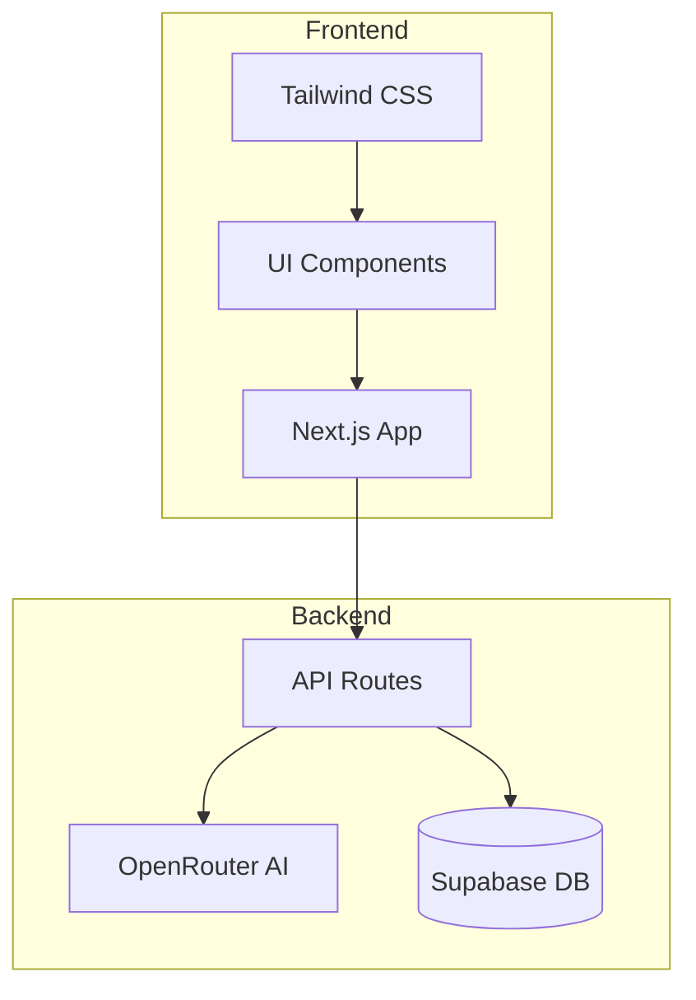
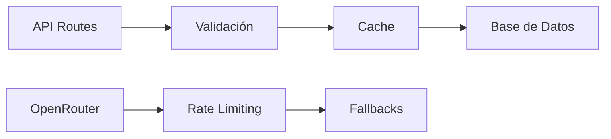
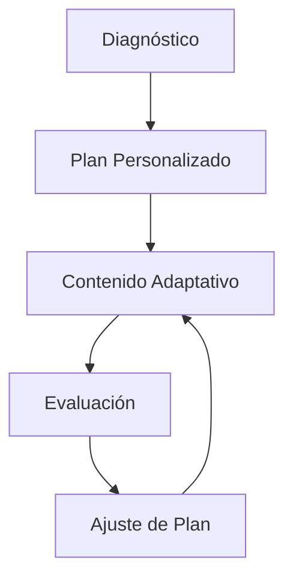

# Plan de Implementación y Mejoras - PAES PRO

## Diagrama de Arquitectura



## 1. Correcciones Inmediatas

### 1.1 Error Tailwind CSS
- **Problema**: Error en `border-border` class y configuración incompleta
- **Solución**: 
  ```mermaid
  graph TD
    A[Actualizar tailwind.config.js] --> B[Extender tema]
    B --> C[Agregar variables CSS]
    C --> D[Definir bordes]
    C --> E[Definir colores]
    C --> F[Definir espaciados]
  ```
- **Pasos**:
  1. Actualizar `tailwind.config.js` con tema completo
  2. Revisar y actualizar `globals.css`
  3. Validar cambios en componentes

### 1.2 Optimización de Next.js
- Eliminar configuraciones obsoletas en `next.config.js`
- Actualizar dependencias deprecadas
- Implementar manejo de errores mejorado

## 2. Mejoras del Sistema

### 2.1 Backend


#### Supabase
- Implementar índices para optimizar consultas frecuentes
- Agregar validaciones a nivel de base de datos
- Mejorar estructura de tablas:
  - Agregar timestamps
  - Implementar soft deletes
  - Optimizar relaciones

#### API Routes
- Implementar rate limiting
- Agregar capa de caché para contenido generado
- Mejorar manejo de errores y logging
- Implementar validación de entrada con Zod

### 2.2 Generación de Contenido
- Optimizar prompts para OpenRouter
- Implementar cache de respuestas frecuentes
- Agregar sistema de fallback para errores de API
- Mejorar la calidad del contenido generado

### 2.3 Sistema de Aprendizaje


- Implementar algoritmo adaptativo mejorado
- Agregar análisis de patrones de aprendizaje
- Mejorar sistema de recomendaciones
- Implementar retroalimentación detallada

## 3. Monitoreo y Métricas

### 3.1 Performance
- Implementar métricas de rendimiento
- Monitorear tiempos de respuesta
- Analizar patrones de uso

### 3.2 Calidad
- Monitorear tasa de errores
- Evaluar calidad del contenido generado
- Seguimiento de progreso de usuarios

## 4. Plan de Implementación

### Fase 1: Correcciones Críticas
1. Resolver error de Tailwind CSS
2. Actualizar configuraciones de Next.js
3. Corregir dependencias deprecadas

### Fase 2: Mejoras de Backend
1. Optimizar base de datos
2. Implementar validaciones
3. Mejorar manejo de errores

### Fase 3: Mejoras de Contenido
1. Optimizar sistema de generación
2. Implementar cache
3. Mejorar algoritmo adaptativo

### Fase 4: Monitoreo
1. Implementar métricas
2. Configurar alertas
3. Establecer KPIs

## Siguientes Pasos

1. Confirmar prioridades del plan
2. Establecer timeline de implementación
3. Asignar recursos necesarios
4. Comenzar con Fase 1

¿Te gustaría proceder con la implementación de este plan? Podemos comenzar con la Fase 1 para resolver los problemas críticos actuales.