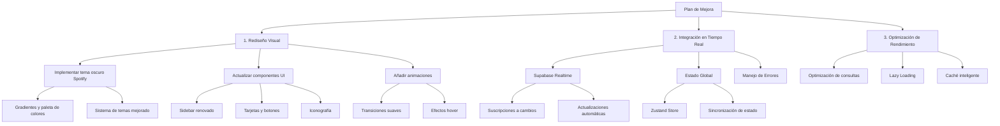

# Plan de Mejoras - Diseño Spotify y Sincronización en Tiempo Real

## Diagrama de Implementación

## 1. Rediseño Visual

### Tema Oscuro Spotify
- Implementar sistema de variables CSS para gradientes característicos de Spotify
- Crear paleta de colores oscuros con acentos verdosos
- Mejorar sistema de cambio de tema con persistencia

### Actualización de Componentes
- Rediseñar sidebar con íconos grandes y efectos hover
- Actualizar tarjetas con bordes suaves y gradientes
- Implementar nueva iconografía consistente
- Mejorar tipografía y espaciado

### Sistema de Animaciones
- Implementar transiciones suaves entre estados
- Añadir efectos hover tipo Spotify
- Optimizar animaciones para rendimiento

## 2. Integración en Tiempo Real

### Supabase Realtime
- Configurar suscripciones a cambios en tablas relevantes
- Implementar actualizaciones automáticas de UI
- Manejar reconexiones y errores

### Estado Global
- Implementar Zustand para manejo de estado
- Sincronizar estado local con Supabase
- Optimizar actualizaciones de UI

## 3. Optimización de Rendimiento
- Implementar lazy loading para componentes pesados
- Optimizar consultas a Supabase
- Implementar sistema de caché inteligente
- Mejorar tiempo de carga inicial

## Tecnologías a Utilizar
- Tailwind CSS para estilos
- Zustand para estado global
- Supabase Realtime para sincronización
- Framer Motion para animaciones
- React Suspense para lazy loading

## Orden de Implementación
1. Configuración inicial de dependencias
2. Implementación del tema oscuro base
3. Actualización de componentes UI
4. Integración de Supabase Realtime
5. Implementación de estado global
6. Optimizaciones de rendimiento
7. Pruebas y ajustes finales